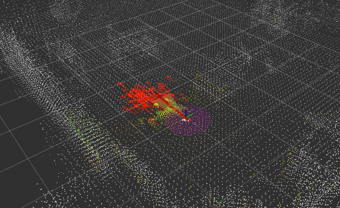

[](https://travis-ci.com/yukkysaito/amcl_3d)

AMCL(Adaptive Monte Carlo Localization) in 3D for ROS.

# Install Requirements

```
$ git clone  https://github.com/rsasaki0109/amcl_3d <catkin_ws/src path>
$ rosdep install --from-paths <amcl_3d path> -y
```

# Demo

```
wget https://openspur.org/~atsushi.w/dataset/mcl_3dl/short_test.bag
```

```
roslaunch amcl_3d amcl_3d_rosbag.launch
```

 

# Reference
## English Reference
### General
- http://www.probabilistic-robotics.org/
### Effective Sampling Size
- http://www.cns.nyu.edu/~eorhan/notes/particle-filtering.pdf
### Avoidance Numerical Underflow
- http://www.maths.lu.se/fileadmin/maths/forskning_research/InferPartObsProcess/particlemethods.pdf

## Japanese Reference
- http://lab.cntl.kyutech.ac.jp/~nishida/lecture/psc/no11.pdf
- https://gihyo.jp/book/2018/978-4-7741-9646-6
- https://qiita.com/MoriKen/items/dfb6eb168649873589f0
